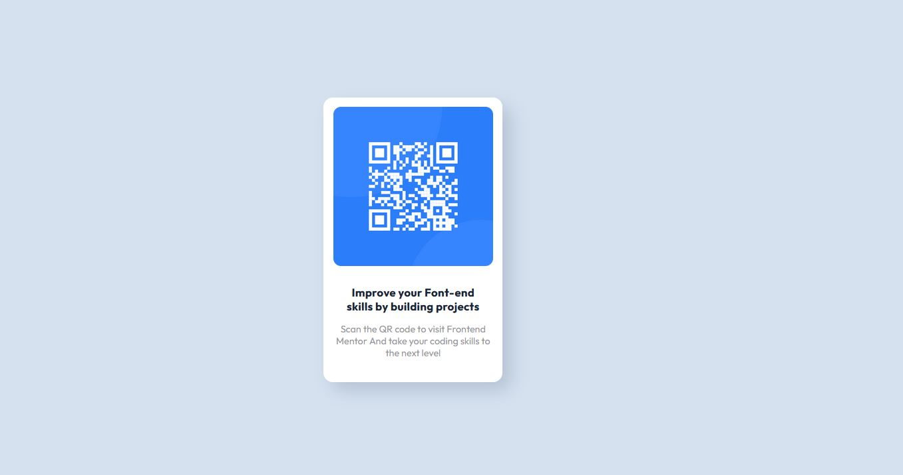

# Frontend Mentor - QR code component solution

This is a solution to the [QR code component challenge on Frontend Mentor](https://www.frontendmentor.io/challenges/qr-code-component-iux_sIO_H). Frontend Mentor challenges help you improve your coding skills by building realistic projects. 

## Table of contents

- [Overview](#overview)
- [Links](#links)
- [My process](#my-process)
- [Built with](#built-with)
- [Continued development](#continued-development)
- [Useful resources](#useful-resources)
- [Author](#author)

## Overview
this is my version of the front end qr code challenge. I made it with css and Html.

### Links

- Solution URL: [Add solution URL here](https://your-solution-url.com)
- Live Site URL: [Add live site URL here](https://your-live-site-url.com)

## My process
This proyect I decided to build with the basic to improve it. I always think that a good foundation is a good building. With this excercise, I decided to not jump into the preprocessor, or framworks, but try to learn at a good level the basics, so i can create greater things on my next steps on the web development world.
### Built with

- Semantic HTML5 markup
- CSS custom properties
- Flexbox
- Mobile-first workflow

### Continued development

decided to keep improving on mobile first design.

### Useful resources

- [Example resource 1](https://lenguajecss.com/css/) - This web really help me to get out of all the things I forget on the way. really helpfull. easy to find what you forget.

## Author

- Github - [Adrian2C](https://github.com/Adrian2C)
- Frontend Mentor - [@Adrian2C](https://www.frontendmentor.io/profile/Adrian2C)
- LinkedIn - [@adriancoceres](https://www.linkedin.com/in/adriancoceres/)
